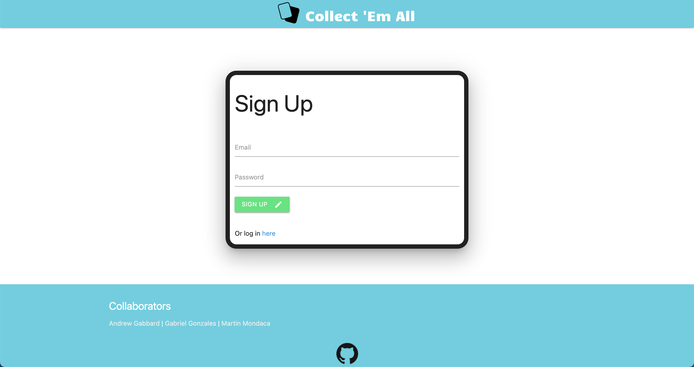
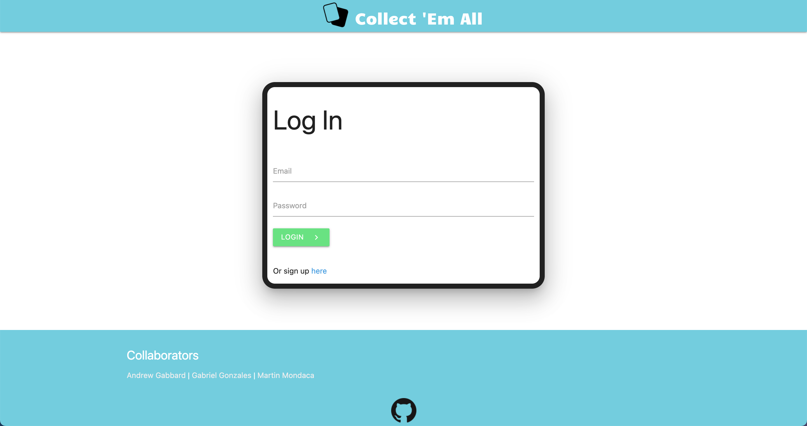
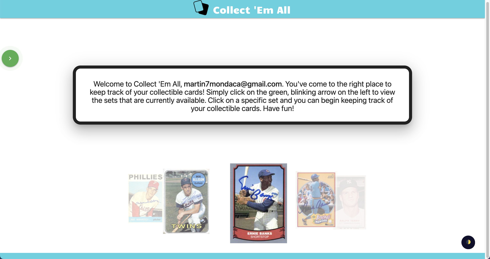
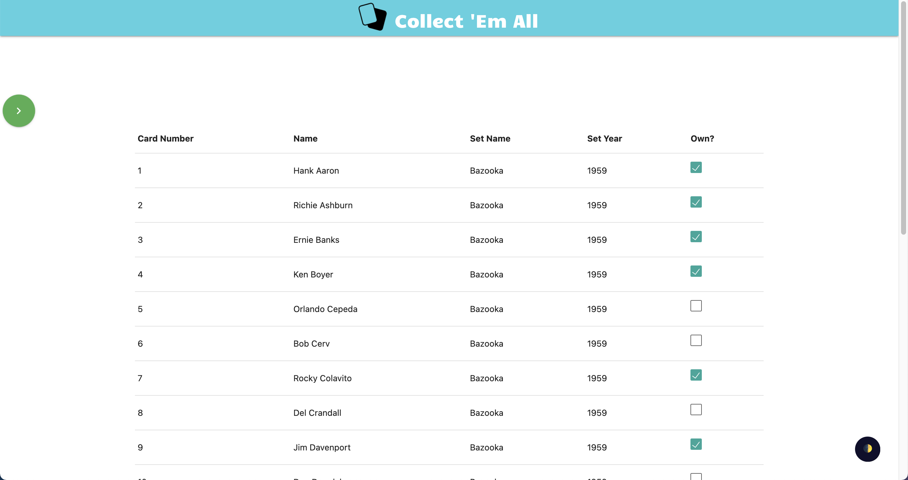

    
  # Collect 'Em All

  ### Table of contents
  * [Description](#description)
  * [Images](#images)
  * [Installation](#installation)
  * [Deployed-Link](#deployed-link)
  * [Usage](#usage)
  * [Technologies-Used](#technologies-used)
  * [Tests](#tests)
  * [Questions](#questions)
  * [Credits](#credits)
  * [License](#license)

  ## Description
  Collect 'Em All is an application used to track physical card collections digitally. Specifically, the current application is designed for Bazooka Baseball cards for the years 1959 to 1990. The application is designed to be a digital DNA of a users physical card collections.
      

  ## Images
  ### Sign Up Page

  ### Log In Page

  ### Home

  ### Card Set

  ## Installation
  No prior installation is required for using this application. Simply head to the deployed link provided below!

      
  ## Deployed-Link
[Collect 'Em All](https://card-collector0.herokuapp.com/)

  ## Usage
  1. Provide an email and password to sign up for Collect 'Em All.
  1. If you have already signed up then click on 'Or log in here' and log in with your email and password.
  1. Click on the blinking geen arrow towards the top left to display the navigation menu.
    1. The navigation menu is where you can find the sets that are available, an option to contact us, and an option to log out.
  1. Click on the type of set you are wanting to keep track of.
  1. Then click on the set name and set year.
  1. Check the boxes next to the cards you own and when you come back to this page after logging in next time; your cards will remain selected.

 ## Technologies-Used
 Some of the most notable technologies and resources used are the following:
 * [Materialize CSS](https://materializecss.com/)
 * [Express.js](https://expressjs.com/)
 * [Express-Handlebars] (https://www.npmjs.com/package/express-handlebars)
 * [Node.js](https://nodejs.org/en/)
 * [Sequelize ORM](https://sequelize.org/)
 * [Passport.js](http://www.passportjs.org/)
 * [MySQL](https://www.mysql.com/)
 * [jawsDB](https://www.jawsdb.com/)
 * [jQuery](https://jquery.com/)
 * [Darkmode.js](https://www.npmjs.com/package/darkmode-js)

  ## Tests
  * This application is deployed to Heroku live; therefore, there are no current tests to run.

  ## Questions
  For further questions you can contact us at:

  GitHub:
  * Gabriel Gonzales [gg2704](https://github.com/gg2704)
  * Andrew Gabbard [ABGABBARD](https://github.com/abgabbard)
  * Martin Mondaca [martinmondaca](https://github.com/martinmondaca)
  
  Email: 
  * abgabbard@gmail.com
  * martin7mondaca@gmail.com

  ## Credits
  * [Andrew Gabbard](https://github.com/abgabbard) 
  * [Martin Mondaca](https://github.com/martinmondaca)
  * [Gabriel Gonzales](https://github.com/gg2704)
  
  Special shoutout to:
  * [Joshua Arroyo](https://github.com/JAA459/).

  ## License
  [GNU GPL v3](https://www.gnu.org/licenses/gpl-3.0)
  Permissions of this strong copyleft license are conditioned on making available complete source code of licensed works and modifications, which include larger works using a licensed work, under the same license. Copyright and license notices must be preserved. Contributors provide an express grant of patent rights.